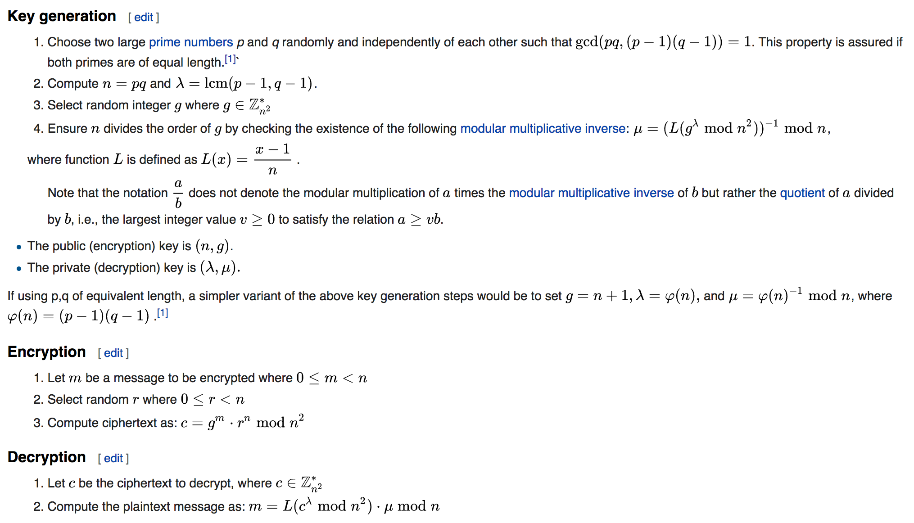

# Homomorphic Encryption

Homomorphic encryption is a form of encryption that allows computation on ciphertexts, generating an encrypted result which, when decrypted, matches the result of the operations as if they had been performed on the plaintext.

## Algorithm


## To build the code. 
```mvn clean package```

## Reference:
https://asecuritysite.com/encryption/pal_ex

https://en.wikipedia.org/wiki/Homomorphic_encryption
